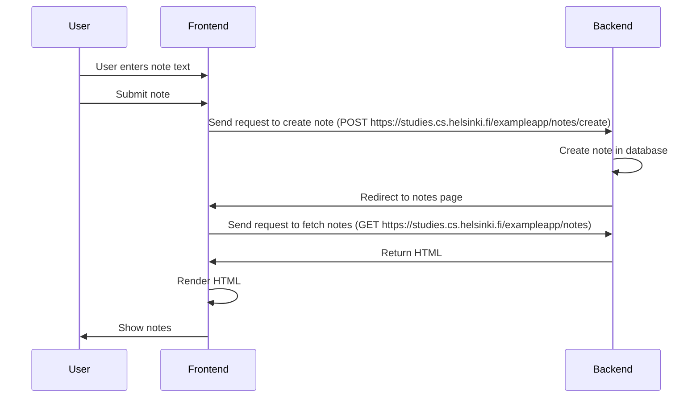

```mermaid
sequenceDiagram
    participant U as User
    participant UI as Frontend
    participant API as Backend

    U->>UI: User enters note text
    U->>UI: Submit note
    UI->>API: Send request to create note (POST  https://studies.cs.helsinki.fi/exampleapp/notes/create)
    API->>API: Create note in database
    API->>UI: Redirect to notes page
    UI->>API: Send request to fetch notes (GET  https://studies.cs.helsinki.fi/exampleapp/notes)
    API->>UI: Return HTML
    UI->>UI: Render HTML
    UI->>U: Show notes
```
