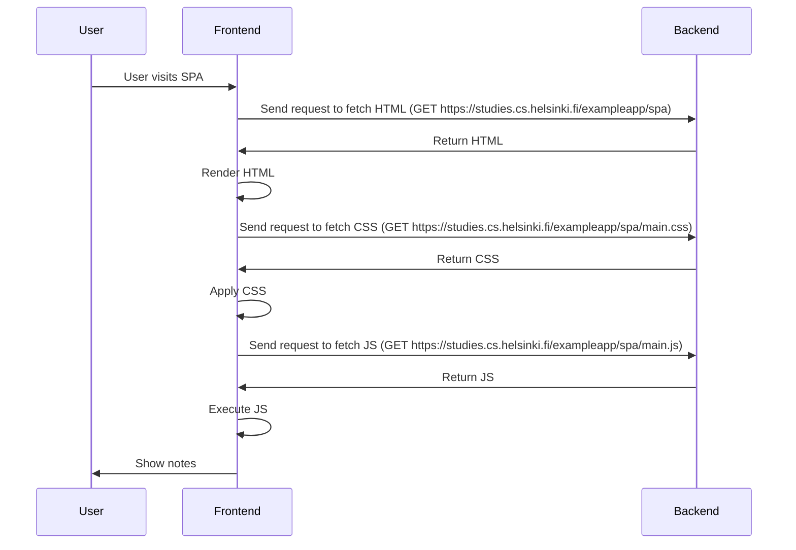

```mermaid
sequenceDiagram
    participant U as User
    participant UI as Frontend
    participant API as Backend

    U->>UI: User visits SPA
    UI->>API: Send request to fetch HTML (GET  https://studies.cs.helsinki.fi/exampleapp/spa)
    API->>UI: Return HTML
    UI->>UI: Render HTML
    UI->>API: Send request to fetch CSS (GET  https://studies.cs.helsinki.fi/exampleapp/spa/main.css)
    API->>UI: Return CSS
    UI->>UI: Apply CSS
    UI->>API: Send request to fetch JS (GET  https://studies.cs.helsinki.fi/exampleapp/spa/main.js)
    API->>UI: Return JS
    UI->>UI: Execute JS
    UI->>U: Show notes
```
